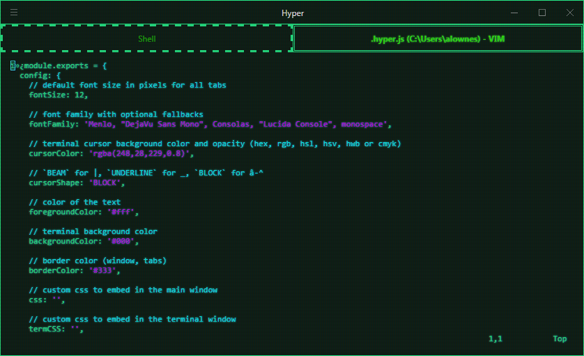

# hyperatompunk

> Atompunk HyperTerm theme

## Install

Add `hyperatompunk` to the plugins list in your `~/.hyperterm.js` config file.

This was originally a fork of [hyperpunk](https://github.com/staltz/hyperpunk) by [Andre Staltz](https://staltz.com)

## License

MIT
